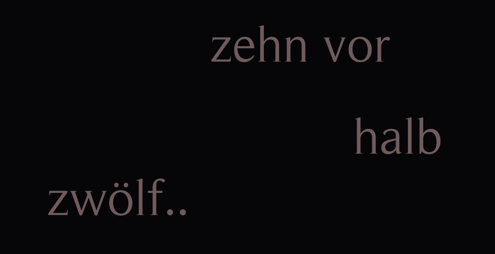

# Text-Clock

Text-Clock can be used as a full screen app that runs in the browser. It displays the current time in German words.

## Features

-   The wording changes every five minutes (German equivalent of "ten minutes before", "five minutes before", ...).
-   Whenever the wording changes, the position on screen is also randomized (while preserving the correct order of words).
-   For the intermediate 4 minutes, the exact same amount of dots is added to the last five-minute-phrase.
    Example: 11:57 would be displayed like "five minutes before twelve.."
-   Depending on the daytime, the color of the text gradually changes as well (red in the morning, blue in the evening).

## Raspberry Pi

Default login:

```
username: pi
password: raspberry
```

Start the desktop by running `startx` (this requires LDXE, see next section)

## Installation

### Tools

Run

```sh
sudo apt install unclutter git chromium-browser systemd-timesyncd ntp lxde-core lxappearance -y
```

Some of these tools might be pre-installed

### Uninstall screensaver

Once the clock was started, the screensaver kicks in after a few minutes. To prevent this, the screensaver can be uninstalled.

```sh
sudo apt remove xscreensaver -y
```

### Download the TextClock application

```sh
cd ~
git clone https://github.com/mohoff/TextClock
```

### Autostart TextClock on Raspberry Pi OS

Create a file at `/home/pi/.config/autostart/textclock.desktop` (e.g. using `vim`) with the following content:

```
[Desktop Entry]
Type=Application
Name=TextClock
Exec=/home/pi/TextClock/startup.sh
StartupNotify=false
```

### Disable screen blanking on Raspberry Pi OS

Edit the file `etc/xdg/lxsessions/LXDE/autostart` (the file at `etc/xdg/lxsessions/LXDE/autostart` refers to an old GUI and is ignored) as follows:

```
@lxpanel --profile LXDE
@pcmanfm --desktop --profile LXDE
@xscreensaver -no-splash

@xset s noblank
@xset s off
@xset -dpms
```

### Update timezone

The current timezone can be corrected using the TUIs `dpkg-reconfigure` or `raspi-config`:

```sh
sudo dpkg-reconfigure tzdata
// or
sudo raspi-config
```

### Enable automatic time update

Make sure the `ntp` daemon and `systemd-timesyncd` are running by checking `service status <SERVICE>`. Installation of these services might require reboots that brings up the daemons.

Then, enable NTP as the time synchronization tool used by `timedatectl`

```sh
sudo timedatectl set-ntp true
```

Running `timedatectl` should print a health status with sychronization turned on.

### Reboot

After everything is set up, reboot the pi with `sudo reboot` or `sudo shutdown -r now`.

## More Features

-   Clock text updates every 5 minutes and each minute in between is indicated with a dot at the end of the last line.
-   Text color changes during daytime. Shades are computed dynamically every 5 minutes in order to display smooth gradients. Currently 5 base colors (grey, yellow, green, blue, red) are in use.
-   Positions of text blocks is calculated randomly but the resulting layout is always drawn in top-to-bottom reading order.

## Screenshots




